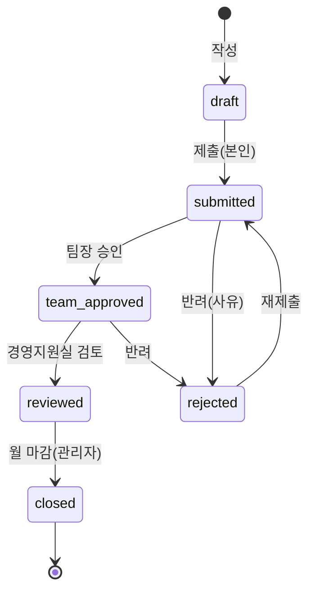

# 상세설계서

**프로젝트:** 경비처리 웹서비스 · **버전:** 1.0 · **작성일:** 2026-07-14

---

## 1. 시스템 아키텍처

```
┌─────────────────────────────────────────────┐
│  Client (React + Vite SPA)                    │
│  로그인 · 대시보드 · 경비신청 · 승인함 · 마감 · 관리     │
└───────────────┬─────────────────────────────┘
                │ HTTPS / REST (JWT)
┌───────────────▼─────────────────────────────┐
│  Application (FastAPI)                         │
│  ├─ api/v1  라우터 (인증·조직·경비·승인·마감·증빙)     │
│  ├─ services 도메인 규칙·OCR·스토리지·엑셀·권한       │
│  └─ core    설정·DB세션·JWT/해시                   │
└───────┬───────────────────────┬─────────────┘
        │                       │
┌───────▼────────┐   ┌──────────▼──────────┐   ┌──────────────────┐
│ PostgreSQL/    │   │ Object Storage       │   │ 외부: CLOVA OCR    │
│ SQLite (ORM)   │   │ (증빙 이미지·엑셀)      │   │ (httpx 연동)       │
└────────────────┘   └─────────────────────┘   └──────────────────┘
```

- **계층 분리**: 라우터(입출력·권한) → 서비스(도메인 규칙) → 모델(영속성). 순수 규칙은
  `services/expense_rules.py`에 격리해 단위 테스트가 가능.
- **외부 연동 격리**: OCR은 `OcrProvider` 인터페이스 뒤에 두어 스텁/CLOVA를 교체 가능. 스토리지도
  `LocalStorage` → S3로 교체 가능한 형태.
- **개발/운영 동일 코드**: SQLAlchemy 제네릭 타입(`Uuid`, `native_enum=False`)으로 SQLite/PostgreSQL 양쪽 동작.

---

## 2. 기술 스택 상세

| 레이어 | 선택 | 비고 |
|---|---|---|
| 백엔드 | FastAPI, SQLAlchemy 2.0, Pydantic v2 | 비동기·타입 안전·자동 문서(/docs) |
| 인증 | PyJWT, bcrypt | Access(30분)+Refresh(14일), RBAC |
| 마이그레이션 | Alembic | 초기 스키마 마이그레이션 포함 |
| OCR | Naver CLOVA OCR + httpx | General/Receipt 응답 모두 파싱, 실패 폴백 |
| 산출물 | openpyxl, zipfile | 엑셀 5시트 + 증빙 ZIP |
| 프론트 | React 18, TypeScript, Vite, Tailwind, TanStack Query | 사내 authed 도구 → SPA |
| 클라우드 | AWS 서울(ap-northeast-2) | ECS Fargate·RDS·S3 (배포 타깃) |

---

## 3. 데이터 모델 (ERD)

```mermaid
erDiagram
    COMPANY ||--o{ DEPARTMENT : has
    DEPARTMENT ||--o{ TEAM : has
    TEAM ||--o{ USER : has
    USER ||--o{ EXPENSE_REPORT : creates
    EXPENSE_REPORT ||--o{ EXPENSE_ITEM : contains
    EXPENSE_REPORT ||--o{ APPROVAL_LOG : has
    USER ||--o{ APPROVAL_LOG : acts
    EXPENSE_ITEM }o--|| ACCOUNT : classified_as
    EXPENSE_ITEM }o--o| VENDOR : from
    EXPENSE_ITEM ||--o| RECEIPT : attaches
    EXPENSE_ITEM }o--o| CLOSING_BATCH : closed_in

    COMPANY { uuid id PK; string biz_no; string name }
    DEPARTMENT { uuid id PK; uuid company_id FK; string name; string code }
    TEAM { uuid id PK; uuid department_id FK; string name }
    USER { uuid id PK; uuid team_id FK; string name; string email UK; string hashed_password; enum role; bool is_active }
    ACCOUNT { uuid id PK; string name UK; bool default_deductible }
    VENDOR { uuid id PK; string biz_no; string name }
    EXPENSE_REPORT { uuid id PK; uuid user_id FK; string title; enum status; string period; datetime submitted_at }
    EXPENSE_ITEM { uuid id PK; uuid report_id FK; uuid account_id FK; uuid vendor_id FK; uuid closing_batch_id FK; string dept_snapshot; string team_snapshot; date tx_date; bigint supply_amount; bigint vat_amount; bigint total_amount; enum evidence_type; bool vat_deductible; enum pay_method; string memo }
    RECEIPT { uuid id PK; uuid item_id FK UK; string image_key; json ocr_json; enum ocr_status }
    APPROVAL_LOG { uuid id PK; uuid report_id FK; uuid actor_id FK; enum action; string comment; datetime created_at }
    CLOSING_BATCH { uuid id PK; string period UK; datetime closed_at; string export_key }
```

### 3.1 주요 엔티티 설명
- **User.role** — `employee | manager | admin`
- **ExpenseReport.status** — `draft | submitted | team_approved | reviewed | closed | rejected`
- **ExpenseItem** — 경비 1건. `dept_snapshot`/`team_snapshot`은 등록 시점 소속을 문자열로 고정(귀속 유지).
  금액은 원 단위 정수(BigInteger).
- **Receipt** — 항목당 1개(1:1). 이미지 저장 키와 OCR 원본/상태 보관.
- **ClosingBatch** — 귀속월 마감 단위. 마감 시 항목에 `closing_batch_id`를 채워 잠금.
- **ApprovalLog** — 승인/반려/검토/마감 이력(감사 로그).

### 3.2 열거형(Enum)
`Role`, `ReportStatus`, `EvidenceType`(tax_invoice/invoice/card/cash_receipt/simple_receipt/etc),
`PayMethod`(corporate_card/personal_card/cash), `OcrStatus`, `ApprovalAction`.

---

## 4. 경비 상태 흐름



- 수정·삭제는 `draft`/`rejected` 상태 + 본인만 허용(제출 후 잠금).
- 마감 시 항목이 `ClosingBatch`에 묶이고 신청서는 `closed`로 잠금.

---

## 5. API 명세

Base URL: `/api/v1` · 인증: `Authorization: Bearer <access_token>` (로그인·리프레시 제외)

### 인증 · 사용자
| Method | Path | 권한 | 설명 |
|---|---|---|---|
| POST | `/auth/login` | - | 로그인(폼: username=email, password) → 토큰 |
| POST | `/auth/refresh` | - | Refresh → Access 재발급 |
| GET | `/auth/me` | 인증 | 내 정보 |
| POST | `/users` | admin | 사용자 등록 |
| GET | `/users` | admin | 사용자 목록 |
| PATCH | `/users/{id}` | admin | 역할·소속팀·활성·이름 수정 |

### 조직
| Method | Path | 권한 | 설명 |
|---|---|---|---|
| GET | `/org` | admin | 회사›부서›팀 트리 |
| POST | `/departments` | admin | 부서 등록 |
| DELETE | `/departments/{id}` | admin | 부서 삭제(팀 없을 때) |
| POST | `/teams` | admin | 팀 등록 |
| DELETE | `/teams/{id}` | admin | 팀 삭제(직원 없을 때) |

### 경비 · 승인
| Method | Path | 권한 | 설명 |
|---|---|---|---|
| GET | `/accounts` | 인증 | 계정과목 목록 |
| POST | `/expenses/reports` | 인증 | 신청서 생성(항목 포함, 소속 자동배부) |
| GET | `/expenses/reports` | 인증 | 목록(본인/팀/전사) |
| GET | `/expenses/reports/{id}` | 인증 | 상세 |
| PUT | `/expenses/reports/{id}` | 본인 | 전체 수정(작성중/반려) |
| DELETE | `/expenses/reports/{id}` | 본인 | 삭제(작성중/반려) |
| POST | `/expenses/reports/{id}/submit` | 본인 | 제출 |
| GET | `/expenses/reports/{id}/validate` | 인증 | 규칙 검증 결과 |
| GET | `/expenses/reports/{id}/history` | 인증 | 승인 이력 |
| POST | `/approvals/{id}/approve` | manager/admin | 팀장 승인 |
| POST | `/approvals/{id}/reject` | manager/admin | 반려(사유 필수) |
| POST | `/approvals/{id}/review` | admin | 검토 완료 |

### 증빙 · 마감
| Method | Path | 권한 | 설명 |
|---|---|---|---|
| POST | `/receipts/ocr` | 인증 | 영수증 업로드→저장+OCR 초안(image_key 반환) |
| GET | `/receipts/{item_id}/image` | 인증 | 증빙 이미지(권한 확인) |
| POST | `/closings` | admin | 월 마감 + 엑셀 생성 |
| GET | `/closings` | admin | 마감 목록 |
| GET | `/closings/{id}/download` | admin | 엑셀 다운로드 |
| GET | `/closings/{id}/receipts-zip` | admin | 증빙 ZIP |

---

## 6. 도메인 규칙 구현 (`services/expense_rules.py`)

```python
QUALIFIED_THRESHOLD = 30_000                     # 3만원 초과 비적격 → 가산세 대상
_VAT_BEARING = {tax_invoice, card, cash_receipt} # 부가세 포함 적격증빙(면세 계산서 제외)

split_amount(total, evidence)      # 과세 적격이면 공급=round(total/1.1), 부가=total-공급
determine_deductible(evidence, account_default)  # 과세 적격 & 공제대상 계정일 때만 True
evidence_warning(total, evidence)  # 3만원 초과 + 비적격 → 경고 문구
amount_ok(supply, vat, total)      # 공급+부가 == 합계
```

- 순수 함수로 격리 → 입력값 기반 단위 테스트(경계·면세·불공제)로 검증.

---

## 7. OCR 파이프라인 (`services/ocr.py`)

```
업로드 → 스토리지 저장(image_key) → CLOVA 호출(X-OCR-SECRET)
     → 응답 분기: receipt(구조화) | fields[](일반 텍스트, 휴리스틱)
     → 정규화(날짜 YYYY-MM-DD, 금액 정수, '합계' 키워드 우선)
     → OcrResult{success, fields, confidence}
     → 실패/저신뢰 → 프론트 수동 입력 폴백
```

- `OcrProvider` 인터페이스: `StubOcrProvider`(미설정) ↔ `ClovaOcrProvider`(설정 시). 자격증명 유무로 자동 선택.
- 예외(네트워크·인증·파싱)는 모두 `success=False`로 흡수해 UX 폴백을 보장.

---

## 8. 인증 · 인가

- **JWT**: Access(단기)+Refresh(장기), `type` 클레임으로 구분. 프론트는 401 시 Refresh로 1회 자동 재시도.
- **RBAC**: `require_roles(*roles)` 의존성으로 라우터 보호. 열람 범위는 `services/permissions.can_view_report`
  (본인/소속 팀/전사)로 공통화.
- **비밀번호**: bcrypt 해시. 자격증명·시크릿은 `.env`로만 주입(git 미포함).

---

## 9. 산출물 (`services/excel_export.py`)

월 마감 시 openpyxl로 **5개 시트** 생성 후 저장:
1. **경비내역** — 일자·부서·팀·거래처·공급가액·부가세·합계·계정·증빙유형·공제·결제수단·적요
2. **부서·팀별 집계** 3. **계정과목별 집계** 4. **부가세 정리(공제/불공제)**

+ 증빙 이미지는 `/closings/{id}/receipts-zip`로 `부서_거래처_일자.확장자` 명명하여 ZIP 제공.

---

## 10. 보안 · 컴플라이언스

- 전 구간 인증, RBAC, 증빙 열람도 신청서 권한 확인
- 스토리지 키는 서버 생성 파일명만 허용(**path traversal 차단**)
- 증빙 5년 보관 정책(운영 S3 수명주기/Object Lock)
- 자격증명 환경변수 주입, 로깅 시 시크릿 제외

---

## 11. 배포 (AWS 타깃)

| 구성 | 서비스 |
|---|---|
| 컨테이너(API) | ECS Fargate (또는 App Runner) |
| DB | RDS for PostgreSQL |
| 스토리지 | S3 (+ Object Lock, 5년 수명주기) |
| 비밀관리 | Secrets Manager |
| 프론트 | S3 + CloudFront |
| 리전 | ap-northeast-2 (데이터 국내 보관) |

Alembic으로 스키마 관리(`alembic upgrade head`), 컨테이너는 `Dockerfile`/`docker-compose.yml` 제공.

---

## 12. 디렉터리 구조 (요약)

```
app/
  core/       config · database · security
  models/     tables(ERD) · enums
  schemas/    auth · user · org · expense · common
  api/v1/     auth · users · org · accounts · expenses · approvals · closings · receipts
  services/   expense_rules · ocr · storage · excel_export · permissions
frontend/src/ pages · components · lib(api·types·format) · auth
alembic/      versions
tests/        test_auth · test_expenses · test_workflow · test_ocr · test_receipts · test_org
```
